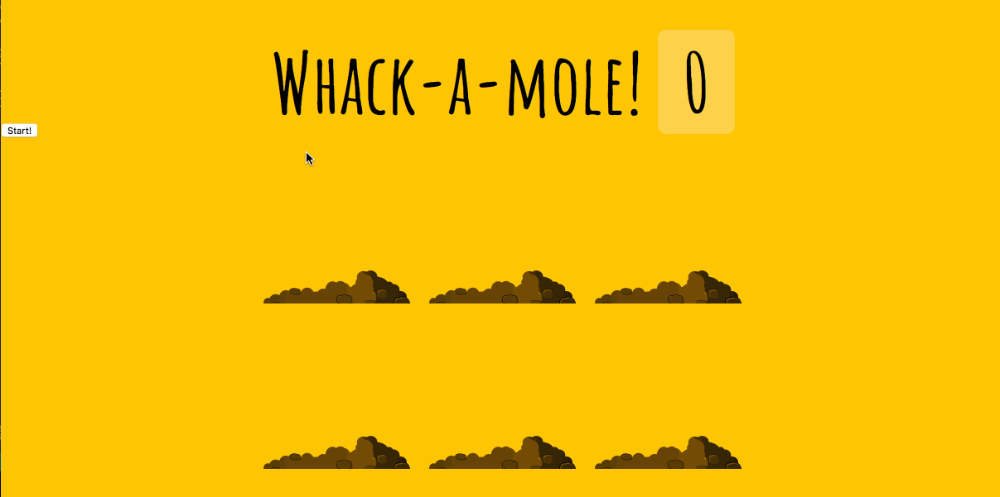

## whack-a-mole ##

This is a web application simulating the game of whack-a-mole. The user clicks a Start button to begin a new game, and then has 10 seconds to click on as many moles as they can. Each mole clicked will be removed and the score will increment by one. Moles appear for random lengths of time in the range of 200ms to 1000ms.

